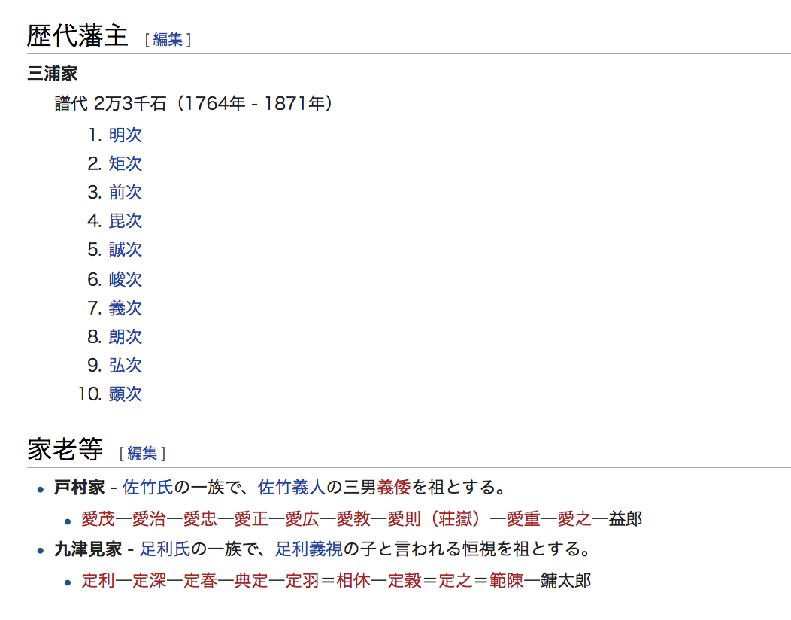

# 必殺技 923

---
## Who is @color[#DC143C](923) ?

---
### Q1.どれが正解でしょう?

- 久津見
- 久津美
- つくね
- 九津見

+++
@quote[Good!]
◎　九津見

+++

## NEXT

+++
### Q2.どれが正解でしょう?

- kusumi
- tsukumi
- tsukune
- kuchumi
- kutsumi

+++

@quote[Good!]
◎　九津見

+++

僕ならこう思います

+++
@quote[紛らわしいんじゃ！！]

---

なのでハンドルネームは`923`　としました!

@quote[九と9が対になる]

+++

これでだいたい覚えられますね。(安心)

---
### 先祖について
故祖父曰く、先祖は岡山の武士で、家老だったようです。

+++
### ちゃっかり九津見家の文字が
美作(みまさか)勝山藩のwikiに載ってます

+++
### 参考
see : [美作勝山藩](https://ja.wikipedia.org/wiki/%E7%BE%8E%E4%BD%9C%E5%8B%9D%E5%B1%B1%E8%97%A9)

+++
私は 九津見家14代(将軍)らしいです.
徳川より長くいけるようにがんばります。

