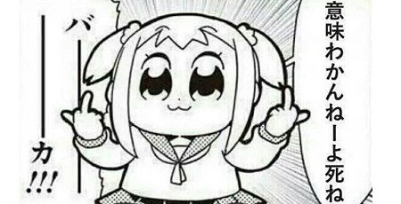
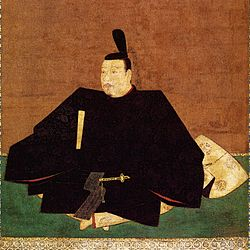

# 必殺技 923

---
## Who is @color[#DC143C](923) ?

---
### Q1.どれが正解でしょう?

- 久津見
- 久津美
- つくね
- 九津見

+++
@quote[Good!]
◎　九津見

+++

## NEXT

+++
### Q2.どれが正解でしょう?

- kusumi
- tsukumi
- tsukune
- kuchumi
- kutsumi

+++

@quote[Good!]
◎　kutsumi

+++

僕ならこう思います

+++
@quote[紛らわしいんじゃ！！]

---

### なのでハンドルネームは`923`　としました!

@quote[九と9が対になる]

+++

### これでだいたい覚えられますね。(安心)

---
### 先祖について
#### 故祖父曰く、
#### 先祖は岡山の武士で、家老だったようです。

+++
#### 美作(みまさか)勝山藩のwikiに載ったりしてます

+++
実は足利の血筋だったりします

+++
#### 私は 九津見家14代(将軍)らしいです.
#### 徳川より長く続くようにがんばります。

+++
### 参考
see : [美作勝山藩](https://ja.wikipedia.org/wiki/%E7%BE%8E%E4%BD%9C%E5%8B%9D%E5%B1%B1%E8%97%A9)

---

# さてさて

---

### もう少しマシなプロフィール紹介

---
## これまで

+++
### 雑多な情報
- 住んでた日本の場所
  - 川崎(生まれてすぐ〜2歳＆5歳〜8歳)
  - 神戸(小2〜小6)
  - 北海道(中１〜浪人)
  - 八王子市(中央大学在籍時)
 
+++
#### 幼少期はタイのバンコクに住んでいた
- 2歳半〜5歳半まで
- 残念ながらタイ人ではない
- 話せるタイ語
  - こんにちは(สวัสดี)
  - あなたの名前はなんですか？(คุณชื่ออะไร)
  - おいしい(อร่อยดี)
  
+++

- 好きな女性のタイプ
  - 華奢な子が好きです　♡
  - 菜々緒とか桐谷美玲とか・・・

+++

それは興味なかった...

---
## 前職
- インターネットセキュリティの会社で営業職
- そこそこ売れた
- 営業行為自体は割と好き
- 時代遅れな体質だったので嫌になりました
- 仕事終わりに毎日コード書いてたらなんとかBPに入れてもらえた

+++

### 詳しくは今度話す予定です |
 ## 「20世紀企業で営業をHackした話」 |
 #### @BPLL |

---
## @kai との関係
- 大学時代のゼミの後輩
- 昨年からずっと一緒にSNSを一緒に作っている |
- 923内定後「お前も受けたら?」って言ったらほんとに来た |

+++
## kaiに売った恩
@quote[kaiが923にもっと++すべき3つの理由]
- kaiが敬語使えなすぎて添削してあげたり。。。 |
- kaiがオーストラリアでナーバスになってるところを話聞いてあげたり。。。 |
- 海外で職に困ってたらBP紹介してあげたり。。。 |

+++

## Slack
#### $923で「海外で職に困った後輩に仕事を紹介するいい先輩なんですよ僕は」
が語録に登録されています。みんな使ってね。

---
## 趣味
- 音楽
  - Bass
  - 好きなジャンルはFusion系(カシオペア好き)
  - スピッツもめちゃすき
- 変なラーメン研究 |
  - 珍しい系のラーメンに特化して詳しくなってます |

+++
- 最近あまりしないけど...
  - 食の人体実験 |
  - 2週間冷奴生活  |
  - 2週間お好み焼き生活 |
  - 東京23区でラーメン食べるまで帰れま10 |
  
---
## 特技
- マッサージ
- お灸

@quote[大抵の体の不調は初期なら自力で治せる]

---
## why proggraming ?
- 923はTwitterに人生狂わされてる |
- なんか特にあまり考えず検察官になろうと思ってた |
- たまたまTwitterやり始めた

+++

- いろんな人フォローしたら同じ事象に対して真逆の意見 |
- よく自分で考える＆情報収集をかかさなくなった
- 「あれ?これ(Twitter)ってどうやってできてるんだろう?」
- 「今度は自分が人の人生を狂わせられるようなものを作りたい」 |

---
#### 僕と岡本太郎主義

>『僕は「幸福反対論者」だ。幸福というのは、自分につらいことや心配なことが何もなくて、ぬくぬくと、安全な状態をいうんだ。
ニブイ人間だけが「しあわせ」なんだ。

+++

>僕は幸福という言葉は大嫌いだ。
僕はその代わりに、「歓喜」という言葉を使う。
危険なこと、つらいこと、つまり死と対決するとき、人間は燃え上がる。
それは生きがいであり、そのとき湧き起こるのが幸せではなくて「歓喜」なんだ。』

---

# THANK YOU

